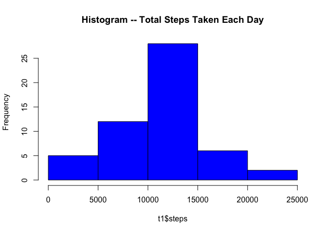
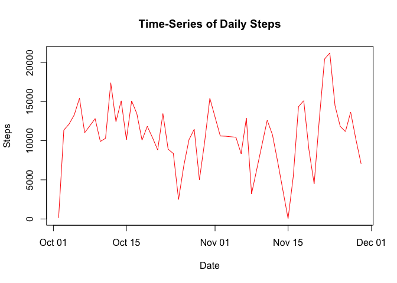
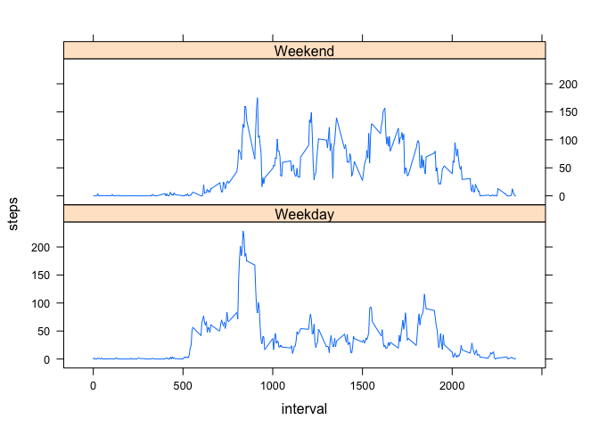

# Reproducible Research: Peer Assessment 1
## Loading and preprocessing the data

```r
library(lubridate)
```

```
## 
## Attaching package: 'lubridate'
```

```
## The following object is masked from 'package:base':
## 
##     date
```

```r
setwd("~/RepData_PeerAssessment1")
activitydata <- read.csv("activity.csv")
activitydata$date <- ymd(activitydata$date)
```


## What is mean total number of steps taken per day?

```r
t1 <- aggregate(steps ~ date, activitydata, sum)
hist(t1$steps, main = "Histogram -- Total Steps Taken Each Day", col = "blue")
```

<!-- -->

```r
m1 <- mean(t1$steps)
m2 <- median(t1$steps)
```
#### _The mean number of steps taken each day 1.0766189\times 10^{4}._
#### _The median number of steps taken each day 10765._

## What is the average daily activity pattern?

```r
plot(t1$date, t1$steps, type = "l", xlab = "Date", ylab = "Steps", main = "Time-Series of Daily Steps", col = "red")
```

<!-- -->

```r
maxstep <- t1[which(t1$steps==max(t1$steps)),1]
```
#### _The maximum average daily steps was recorded on 2012-11-23._


## Imputing missing values

```r
ad1 <- activitydata
missingDataSum <- sum(is.na(ad1$steps))
t2 <- aggregate(steps ~ interval, ad1, median)

ad1$steps[which(is.na(ad1$steps))] <- t2$steps[which(t2$interval ==                                         ad1$interval[which(is.na(ad1$steps))])]

t3 <- aggregate(steps ~ date, ad1, sum)
hist(t3$steps, main = "Histogram -- Total Steps Taken Each Day (Imputed)", col = "blue")
```

<!-- -->

```r
m3 <- mean(t3$steps)
m4 <- median(t3$steps)

diff1 <- mean(t3$steps) - mean(t1$steps)
diff2 <- median(t3$steps) - median(t1$steps) 
```
#### _There are 2304 missing data points in the original dataset._
#### _Strategy used to impute missing values --> Take median of 5 minute interval._
#### _The mean number of steps taken each day using imputed strategy 1.0587944\times 10^{4}._
#### _The median number of steps taken each day using imputed strategy 1.06825\times 10^{4}._
#### _The new strategy resulted in change in mean by -178.2442348 and median by -82.5._


## Are there differences in activity patterns between weekdays and weekends?

```r
library(chron)
```

```
## 
## Attaching package: 'chron'
```

```
## The following objects are masked from 'package:lubridate':
## 
##     days, hours, minutes, seconds, years
```

```r
library(lattice)
ad1$weekend <- as.factor(is.weekend(ad1$date))
levels(ad1$weekend) <- c("Weekday", "Weekend")

## Scratch
weekdayData <- subset(ad1, ad1$weekend == "Weekday")
weekendData <- subset(ad1, ad1$weekend == "Weekend")

wd1 <- aggregate(steps ~ interval, weekdayData, mean)
we1 <- aggregate(steps ~ interval, weekendData, mean)

we1$weekend <- TRUE
wd1$weekend <- FALSE

test <- rbind(wd1, we1)
test$weekend <- as.factor(test$weekend)
levels(test$weekend) <- c("Weekday", "Weekend")

xyplot(steps ~ interval | weekend, data = test, layout = c(1,2), type = "l")
```

<!-- -->

#### Looks like people start their days earlier on weekdays.  The activity peaks early, then trails off.  While weekend activty starts later, but activity level stays more or less the same thru the day.
